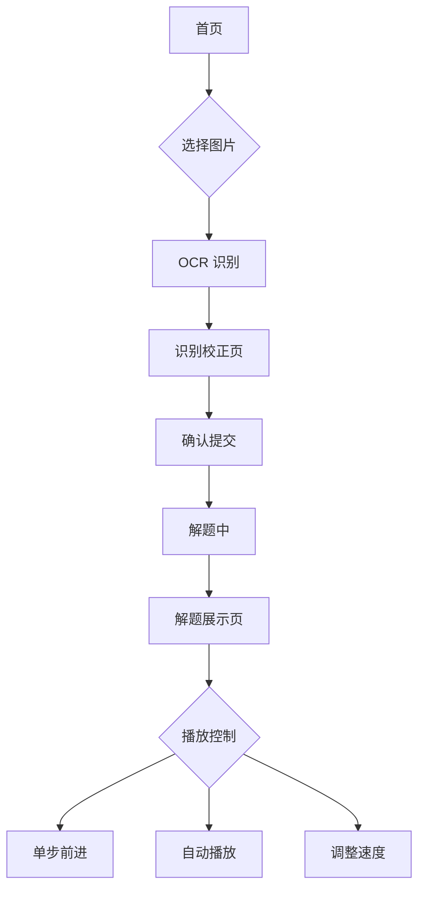

## 1. 产品概述

构建一个基于 Web 的数独解题工具，支持用户通过拍照或上传图片自动识别数独题目，并提供完整的解题过程可视化展示。该产品帮助数独爱好者快速解题并学习解题技巧，适用于桌面和移动设备。

目标用户：数独爱好者、学生、教育工作者，市场价值在于提供便捷的数独学习和解题体验。

## 2. 核心功能

### 2.1 用户角色

| 角色   | 注册方式 | 核心权限                    |
| ---- | ---- | ----------------------- |
| 普通用户 | 无需注册 | 上传图片、识别数独、查看解题过程、调整播放速度 |

### 2.2 功能模块

本数独解题工具包含以下核心页面：

1. **首页**：图片上传区域、数独棋盘展示、解题控制面板
2. **识别校正页面**：OCR 结果预览、数字编辑校正、确认提交
3. **解题展示页面**：步骤播放控制、棋盘状态显示、解题统计信息

### 2.3 页面详情

| 页面名称  | 模块名称     | 功能描述                       |
| ----- | -------- | -------------------------- |
| 首页    | 图片上传区    | 支持拖拽上传、点击选择、手机拍照，显示上传进度    |
| 首页    | 数独棋盘     | 9×9 网格显示，支持手动输入数字，高亮当前选中格子 |
| 首页    | 控制面板     | 开始解题按钮、播放速度设置、步骤计数显示       |
| 识别校正页 | OCR 结果预览 | 显示识别的数字矩阵，标记置信度低的格子        |
| 识别校正页 | 数字编辑器    | 点击格子修改数字，支持数字键盘输入          |
| 识别校正页 | 确认提交     | 确认校正结果，进入解题流程              |
| 解题展示页 | 棋盘可视化    | 实时显示解题步骤，高亮新填入的数字          |
| 解题展示页 | 播放控制     | 单步前进/后退、自动播放/暂停、速度调节       |
| 解题展示页 | 统计信息     | 显示总步数、当前步骤、解题用时            |

## 3. 核心流程

用户操作流程：

1. 用户进入首页，选择上传数独图片或拍照
2. 系统进行 OCR 识别，展示识别结果
3. 用户校正识别错误的数字，确认提交
4. 系统开始解题并记录步骤
5. 用户可控制解题过程的播放，观察每一步的变化

## 4. 用户界面设计

### 4.1 设计风格

* **主色调**：深蓝色 (#1e40af) 搭配白色背景

* **强调色**：绿色 (#10b981) 表示成功，橙色 (#f59e0b) 表示警告

* **按钮样式**：圆角矩形，阴影效果，悬停状态变化

* **字体**：系统默认字体，标题 18-24px，正文 14-16px

* **布局风格**：卡片式布局，清晰的视觉层次

* **图标风格**：使用简洁的线性图标，统一尺寸和风格

### 4.2 页面设计概述

| 页面名称  | 模块名称 | UI 元素                         |
| ----- | ---- | ----------------------------- |
| 首页    | 上传区域 | 虚线边框的拖拽区域，中央显示上传图标，支持拖拽高亮效果   |
| 首页    | 数独棋盘 | 9×9 网格，粗线分隔 3×3 宫格，当前选中格子蓝色高亮 |
| 首页    | 控制按钮 | 大尺寸绿色按钮，圆角设计，悬停变深，点击有波纹效果     |
| 识别校正页 | 数字网格 | 与棋盘相同布局，错误数字红色边框，低置信度黄色背景     |
| 识别校正页 | 编辑工具 | 底部数字键盘，选中状态明显，支持清除和重置         |
| 解题展示页 | 播放控制 | 居中的播放按钮组，包含前进、后退、播放/暂停        |
| 解题展示页 | 速度设置 | 滑块控制，显示当前速度值，支持预设快捷选项         |

### 4.3 响应式设计

* **桌面优先**：默认设计为桌面端，充分利用屏幕空间

* **移动端适配**：

  * 数独棋盘自适应缩放，最小触摸目标 44×44px

  * 控制按钮垂直排列，避免误触

  * 图片上传区域全宽显示，支持横竖屏切换

* **断点设置**：768px 为移动端分界点，调整布局和字体大小

## 5. 性能要求

* OCR 识别时间：单张图片不超过 5 秒

* 解题速度：普通难度不超过 1 秒，困难难度不超过 3 秒

* 步骤播放：支持 100ms-2000ms 可调节间隔

* 内存占用：解题过程中不超过 50MB

* 首次加载：核心功能 JS 包不超过 300KB (Next.js 自动优化)

* SEO 优化：支持服务端渲染，提升搜索引擎收录

