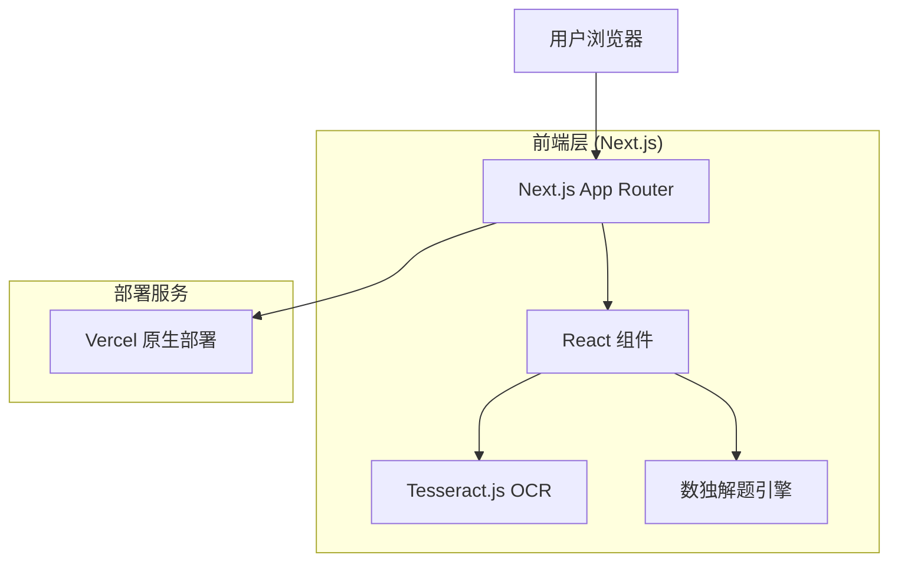

## 1. 架构设计



## 2. 技术栈描述

* **前端框架**: Next.js\@14+ (App Router) + TypeScript

* **初始化工具**: create-next-app

* **样式方案**: Tailwind CSS\@3

* **OCR 库**: Tesseract.js

* **状态管理**: React Hooks (useState, useEffect, useReducer)

* **部署平台**: Vercel (GitHub 集成)

* **图标库**: Lucide React (轻量级图标)

## 3. 路由定义

| 路由路径     | 页面功能             |
| -------- | ---------------- |
| /        | 首页，包含上传和数独棋盘     |
| /correct | 识别校正页面，编辑 OCR 结果 |
| /solve   | 解题展示页面，播放解题过程    |

## 4. 核心类型定义

### 4.1 数独相关类型

```typescript
// 数独棋盘类型 (9x9 网格，0 表示空格)
type SudokuBoard = number[][];

// 解题步骤
type SolveStep = {
  row: number;        // 行索引 (0-8)
  col: number;        // 列索引 (0-8)
  value: number;      // 填入的数字 (1-9)
  board: SudokuBoard; // 当前棋盘状态
  reason?: string;   // 解题原因描述
};

// OCR 识别结果
type OCRResult = {
  board: SudokuBoard;
  confidence: number[][];  // 每个数字的置信度 (0-100)
};

// 播放状态
type PlayState = 'idle' | 'playing' | 'paused' | 'completed';

// 解题设置
type SolveSettings = {
  playSpeed: number;      // 播放速度 (毫秒)
  autoPlay: boolean;       // 是否自动播放
};
```

### 4.2 组件 Props 类型

```typescript
// 数独棋盘组件
type SudokuBoardProps = {
  board: SudokuBoard;
  highlightedCell?: { row: number; col: number };
  editable?: boolean;
  onCellChange?: (row: number, col: number, value: number) => void;
};

// 解题控制器组件
type SolveControllerProps = {
  currentStep: number;
  totalSteps: number;
  playState: PlayState;
  onPlay: () => void;
  onPause: () => void;
  onStepForward: () => void;
  onStepBackward: () => void;
  onSpeedChange: (speed: number) => void;
};
```

## 5. 项目结构

```
sudoku-solver/
├── public/                 # 静态资源
│   └── favicon.ico
├── app/                    # Next.js App Router
│   ├── page.tsx           # 首页 (对应原来的 /)
│   ├── correct/page.tsx   # 识别校正页面 (对应原来的 /correct)
│   ├── solve/page.tsx     # 解题展示页面 (对应原来的 /solve)
│   ├── layout.tsx         # 根布局
│   ├── globals.css        # 全局样式
│   └── favicon.ico        # 网站图标
├── components/             # React 组件
│   ├── SudokuBoard.tsx      # 数独棋盘组件
│   ├── ImageUploader.tsx    # 图片上传组件
│   ├── SolveController.tsx  # 解题控制器
│   ├── CorrectionGrid.tsx   # 校正网格组件
│   └── common/              # 通用组件
│       ├── Button.tsx
│       └── Loading.tsx
├── hooks/                  # 自定义 Hooks
│   ├── useOCR.ts           # OCR 处理
│   ├── useSudokuSolver.ts  # 数独解题
│   ├── useStepPlayer.ts    # 步骤播放控制
│   └── useImageUpload.ts   # 图片上传
├── lib/                    # 工具函数 (Next.js 约定)
│   ├── sudokuSolver.ts     # 数独算法
│   ├── sudokuValidator.ts  # 数独验证
│   └── constants.ts        # 常量定义
├── services/               # 服务层
│   └── ocrService.ts      # OCR 服务封装
├── types/                  # TypeScript 类型
│   └── index.ts
├── package.json
├── tsconfig.json
├── tailwind.config.js
├── next.config.js         # Next.js 配置
├── vercel.json            # Vercel 部署配置
└── .env.local             # 环境变量
```

## 6. 核心算法实现

### 6.1 数独解题算法 (回溯法)

```typescript
// src/utils/sudokuSolver.ts
export function solveSudoku(board: number[][]): SolveStep[] {
  const steps: SolveStep[] = [];
  const workingBoard = board.map(row => [...row]);
  
  function isValid(board: number[][], row: number, col: number, num: number): boolean {
    // 检查行
    for (let x = 0; x < 9; x++) {
      if (board[row][x] === num) return false;
    }
    
    // 检查列
    for (let x = 0; x < 9; x++) {
      if (board[x][col] === num) return false;
    }
    
    // 检查 3x3 宫格
    const startRow = row - (row % 3);
    const startCol = col - (col % 3);
    for (let i = 0; i < 3; i++) {
      for (let j = 0; j < 3; j++) {
        if (board[i + startRow][j + startCol] === num) return false;
      }
    }
    
    return true;
  }
  
  function solve(): boolean {
    for (let row = 0; row < 9; row++) {
      for (let col = 0; col < 9; col++) {
        if (workingBoard[row][col] === 0) {
          for (let num = 1; num <= 9; num++) {
            if (isValid(workingBoard, row, col, num)) {
              workingBoard[row][col] = num;
              steps.push({
                row,
                col,
                value: num,
                board: workingBoard.map(r => [...r]),
                reason: `在位置 (${row + 1}, ${col + 1}) 填入 ${num}`
              });
              
              if (solve()) return true;
              
              workingBoard[row][col] = 0; // 回溯
            }
          }
          return false;
        }
      }
    }
    return true;
  }
  
  solve();
  return steps;
}
```

## 7. 部署配置

### 7.1 Next.js 配置 (next.config.js)

```javascript
/** @type {import('next').NextConfig} */
const nextConfig = {
  output: 'standalone',
  images: {
    domains: ['localhost'],
  },
  // Vercel 原生支持，无需额外配置
}

module.exports = nextConfig
```

### 7.2 构建脚本 (package.json)

```json
{
  "scripts": {
    "dev": "next dev",
    "build": "next build",
    "start": "next start",
    "lint": "next lint",
    "deploy": "vercel --prod"
  }
}
```

## 8. 性能优化

* **代码分割**: Next.js 自动按页面分割，支持动态导入

* **图片优化**: Next.js Image 组件自动优化，支持 WebP 格式

* **OCR 优化**: Web Worker 处理，避免阻塞主线程

* **算法优化**: 预计算可能的数字，减少回溯次数

* **缓存策略**: Next.js 数据缓存和本地存储结合

* **静态优化**: 自动静态优化，提升首屏加载速度

